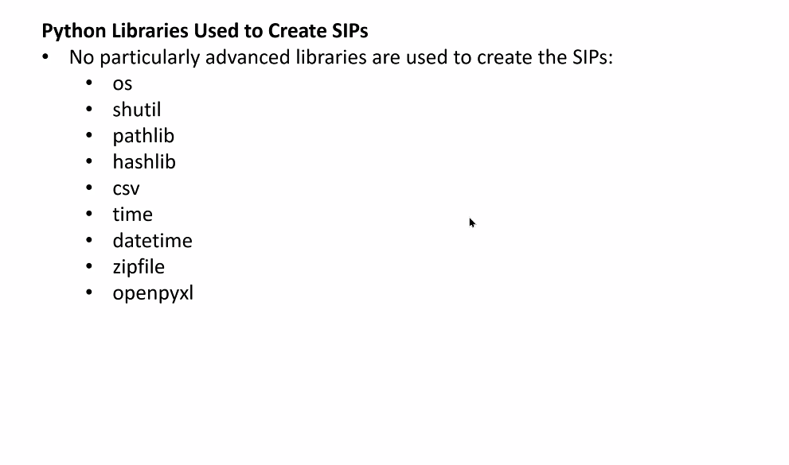
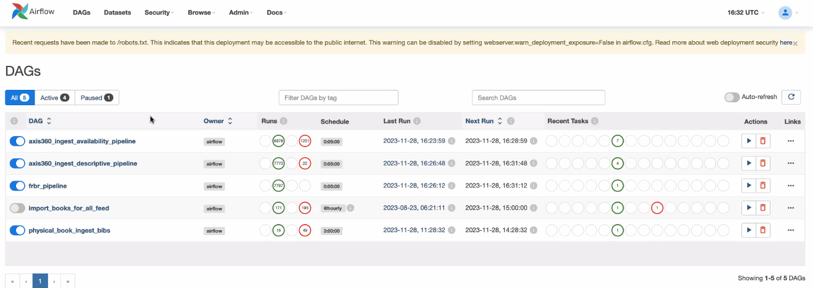
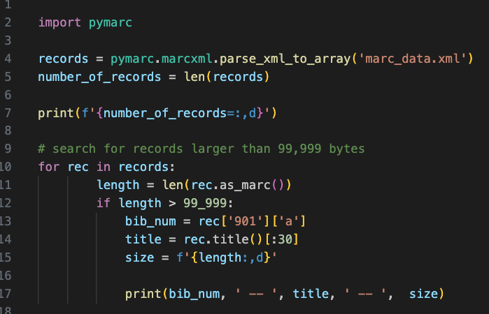

### May 16, 2024 (Code4Lib Post-Conference Session)
  + Eric Phetteplace ran a workshop on [Python4Lib](https://2024.code4lib.org/workshop/Python4Lib) at Code4Lib 2024 in Ann Arbor
  + Started with an open discussion where we talked about people's experience with Python and some general topics
    + Some folks were mainly familiar with running Python in notebooks, others were more familiar with running Python scripts
    + We spoke a bit about managing dependencies and tools like Pipenv/Poetry that help with this and abstract over virtual environments
    + We discussed asyncio and asynchronoous programming generally, when to use it, what types of problems it addresses, and CPU-bound (computation heavy) vs IO-bound (network/files heavy) tasks
    + Eric introduced his [`marcgrep`](https://github.com/phette23/marcgreppy) CLI tool for searching MARC records
  + We worked through the [c4l24-python4lib](https://github.com/phette23/c4l24-python4lib) repo which has notebooks on several topics. The only topics we covered specifically were:
    + [Jupyter Notebooks](https://github.com/phette23/c4l24-python4lib/blob/main/docs/notebooks.md) (the material was delivered as notebooks)
    + [Pymarc](https://github.com/phette23/c4l24-python4lib/blob/main/docs/pymarc.ipynb) and common usage patterns, the most foolproof ways to get and modify record information
    + [Pandas](https://github.com/phette23/c4l24-python4lib/blob/main/docs/pandas.ipynb) and its fundamental concepts (DataFrames, Series), how to summarize loaded data, stopped after introducing how to filter via bracket expressions

### April 30, 2024
  + David asked if anyone had experience with or knew of any automated discard assessment tools
    + Javier said he has 25,000 volumes to assess for discard
    + Tomasz said other groups may know more about these types of tools because tech services may not have responsibility for collections assessment. Reference librarians may know more about potential tools to use.
    + Sara Amato has used OCLC API “to look at WC holdings and compare also to HathiTrust and comparisons to other libraries in our group to help make decisions - not great for large scale projects but good for smaller lists. I don’t have the code up anywhere though… and it doesn’t have any item level data like circ.”
 + Tomasz asked if Pymarc will have a new release due to a change in how indicators are handled
   + Indicators will be a named tuple that can only have two positions rather than a list which could be of any length
     + The change is outlined in this merge request: https://gitlab.com/pymarc/pymarc/-/merge_requests/206
   + Ed: No scheduled release, reluctant to introduce another major version with breaking changes
   + More discussion of the change is in the [pymarc google group](https://groups.google.com/g/pymarc/c/cMkDb-dDDBY?pli=1)
 + Michael asked if anyone has experience working with APIs for wikimedia/wikimedia commons
   + He has copyright free newspaper images he would like to upload in bulk as PDFs (rather than image files which the other wikicommons tools can use)
   + Javier mentioned using the APIs to get data out of wikimedia commons but not to POST data
 + Tomasz asked about Michael’s involvement in movement to preserve Ukrainian cultural heritage materials after the start of the full scale invasion
   + Michael noted there are two parts to this preservation work:
     + [SUCHO](https://www.sucho.org/) works on preserving publicly available materials
     + There is a separate effort to back up digital materials that are not publicly available
   + Michael mentioned Maryna Paliienko, a Fulbright Scholar from Taras Shevchenko University, whose project focuses on archives
     + Maryna and Michael recently gave a presentation at NYU: https://www.nycarchivists.org/event-5671162
 + Michelle asked for help figuring out why her API calls hang when she tries to upload large files
   + Files are ~2GB and she is posting them using the DSpace API. The files have to be read in binary before uploading them and the requests just hang after uploading the file successfully
   + Yamil mentioned that Python has issues with downloading files that are larger than available RAM and wondered if it has a similar issue with uploading files larger than available RAM
     + He also provided link to streaming uploads with Requests: https://requests.readthedocs.io/en/latest/user/advanced/#streaming-uploads
   + Impromptu code review: https://github.com/mjanowiecki/dspace7-rest-api/blob/main/post/postItemsToCollection.py
     + Susan asked if the code is sending the correct residual size
     + If chunks are in unequal sizes (or the last chunk is not the same size as the others), the API will wait for the last chunk to reach the size of the other chunks
     + Ed said it could be helpful to add the complete upload size in the content-length header with the POST request
   + Michelle provided a link to a tool that makes it easier to authenticate using the DSpace API: https://github.com/the-library-code/dspace-rest-python/tree/main
 + John asked if anyone had recommendations for tools to use to take messy data from google docs and publish it to a dashboard a couple of times a year
   + Has been looking at [Streamlit](https://streamlit.io/) and [Pygwalker](https://github.com/Kanaries/pygwalker) as potential options
     + Pygwalker has tableau-like display
   + Jeremy used streamlit for a project with Hopkins Marine Station: https://taxa.stanford.edu/
     + One issue he noted was that every time a user would interact with the dashboard it would completely reload
 + Michael mentioned stumbling across a tool called [Discorpy](https://discorpy.readthedocs.io/en/latest/index.html) and thought it may be of interest after discussion in last Python4Lib session about image cropping/manipulation
   + It is a tool for measuring lens distortion in a camera
 + Yamil mentioned he is learning about [SeleniumBase](https://seleniumbase.io/)

### April 16, 2024
 + David provided an update on the upcoming Python4Lib presentation schedule:
   + April 30 - open topics
   + May 14 - skipped, C4L in person
   + May 28 - Thomas will be talking Jupyter Kernel Gateways
   + June 11 - Rebecca will be talking Postman
 + Eric Phetteplace spoke about hosting a Python4Lib workshop at the upcoming Code4Lib conference
   + https://2024.code4lib.org/workshop/Python4Lib
   + He mentioned that he would welcome a a volunteer to help with session and mentione that he can probably get the cost of the workshop refunded for the volunteer
     + It’ll be a loose conversation similar to a Python4Lib missing and will cover more specific topics in the second half
     + He mentioned asyncio as a potential topic he would like to explore in the session
 + Eric spoke about getting access to some High Performance Computing and exploring parallel processing
   + He mentioned that this set up has a “head node” that coordinates with the other nodes
   + We shared some links with information on parallel work in Python
     + https://realpython.com/python-concurrency/
     + https://docs.python.org/3/library/multiprocessing.html
     + https://realpython.com/async-io-python/
     + https://realpython.com/python-gil/
   + Then we spent a long time talking about the pros and cons of doing parallel work with Python
     + Clinton had some details and examples of reasons why Python’s language design makes it comparatively very slow for parallel work compared to many other languages like Rust and C
     + GIL is going away https://www.blog.pythonlibrary.org/2023/08/16/global-interpreter-lock-optional-in-python-3-13/
 + We also talked about how despite the fact that Python is slower than other languages, you can take existing Python code/projects and update them over to the current parallel options in Python and in many situations you can still get really good improvements in performance
   + Michelle shared an example of working with the Alma API using asyncio
   + Her work went from a runtime of 1 hour for 2000 API calls to 5 minutes for 2000 API calls
     + https://github.com/jhu-library-applications/alma-api/blob/main/updateItemFieldsFromCSVAsync.py
     + Her code updates Alma items from a CSV, doing batches of 1000 rows at a time from the spreadsheet (to help catch errors in more manageable sets)
   + Clinton also shared a Python profiler, to help see what parts of your code are running slow/fast and which parts are using C-based code (which runs faster)
     + https://github.com/plasma-umass/scalene
     + He also shared apresentaion on python performance
       + [Python Performance Matters by Emery Berger (Strange Loop 2022)](https://www.youtube.com/watch?v=vVUnCXKuNOg)
   + Jerrell asked if anyone had been working on AI assisted image cropping
     + No one had worked on this yet but many people are interested in the topic
   + We briefly talked about the use of [Whisper (from OpenAI)](https://openai.com/research/whisper) to create transcripts of videos
     + We also spoke about [Otter AI](https://otter.ai/), another transcript platform that can use Zoom
   + Handprint also came up
     + https://2022.code4lib.org/talks/Handprint-A-program-to-explore-and-compare-major-cloudbased-services-for-handwritten-text-recognition

### April 2, 2024
 + Charlotte and Tomasz have released a new [version (1.0) of Bookops-Worldcat](https://github.com/BookOps-CAT/bookops-worldcat), a Python wrapper for the WorldCat Metadata API.
   + The new version supports changes made in [version 2.0 of the Metadata API](https://developer.api.oclc.org/wc-metadata-v2).
   + The documentation is available on GitHub pages: https://bookops-cat.github.io/bookops-worldcat/
 + Lauren at Rice is working on a reclamation project, gave a shoutout to Rebecca for some python notes she shared in the past.
   + Here is Rebecca’s code:
     + Pulls specified data from holdings records in Alma, using the Bibs API
     + https://github.com/LibraryNinja/Holdings_Record_Inpsector
 + Rebecca talked about her recent work using Tkinter. She has been changing code written using PySimpleGUI to Tkinter after PySimpleGUI changed their licensing and would require a fee for higher ed use.
     + https://docs.python.org/3/library/tkinter.html
     + https://realpython.com/python-gui-tkinter/
     + https://github.com/TomSchimansky/CustomTkinter
   + Someone asked Rebecca for beginer Tkinter resources and she recommended two courses/videos
     + [Create Graphical User Interfaces With Python And TKinter](https://www.youtube.com/playlist?list=PLCC34OHNcOtoC6GglhF3ncJ5rLwQrLGnV)
     + [A Linkedin Learning Course](https://www.linkedin.com/learning/python-gui-development-with-tkinter-2?u=2147385)
   + Eric asked if once can create a single executable with a custom desktop icon for the resulting app with Tkinter
     + Rebecca said it is possible, but would require the use of a packaging utility
       + Rebecca: “PyInstaller is the thing that packages it all up using the command line, Auto-py-to-exe is a layer on top for it”
 + Emily had a question about using pymarc for some batch edits, but it did not work as she hoped(?)
   + “At my institution, we’ve got one person (me) identifying OCLC numbers for changes in one, now pymarc script, that a second person then feeds into the Metadata API 2.0 to make changes. Using the BookOps library would we be able to integrate the script searching for identifiers with the script that makes batch changes?”
 + Charles shared a new project he and Eddie are working on using Flask to connect to the Alma API
   + https://flask.palletsprojects.com/en/3.0.x/
   + https://en.wikipedia.org/wiki/Flask_(web_framework)
   + The application lives on the Azure cloud, but it runs via Docker for local tests and on the cloud
 + Javier asked about Charles' use of ChatGPT 4, if he could share reasons to justify the cost of chatGPT 4
   + Javier also asked about the various “personas” that Charles used.
   + Charles then explained how to give “context” to each “persona.” Like stating that the human users is already experienced in programming.
   + Charles also mentioned that he asks chatGPT questions that chatGPT may need answered before it can properly answer a particular prompt (or all prompts going forward for a single “persona”)
   + Charles also recommended other LLMs that worked well for him for code questions if you cannot pay for ChatGPT 4 (some of the ones below have paid versions too)
     + https://www.phind.com/search
     + https://www.anthropic.com/claude

### March 19th, 2024
 + Yamil and Charlotte gave a presentation on Python Virtual Environments & requirements.txt
   + https://docs.google.com/presentation/d/1XvnmQFdCkBWnD4javgJ0SPn-Uzp7F8if4dIh6qPxKos/edit?usp=sharing
 + Q&A/Discussion
   + Using pyproject.toml vs. requirements.txt
     + pyproject.toml files are more complex/powerful
     + this should be a presentation topic in the future
     + https://packaging.python.org/en/latest/guides/writing-pyproject-toml/
   + Dependency management and how to properly deploy code to someone else’s machine
   + pipx: https://github.com/pypa/pipx
     + how to install packages globally while still keeping them separate form the global Python install

### March 5th, 2024
 + Rebecca mentioned that Pysimple GUI has moved to a license model and was wondering if it is common for a package to move to a closed license
   + Clinton mentioned he has seen it maybe 5 times
   + It makes projects very brittle because every person needs to get a key annually
 + We discussed alternatives to PySimpleGUI
   + TKinter: https://docs.python.org/3/library/tkinter.html
   + PyQt: https://wiki.python.org/moin/PyQt
   + Clinton also mentioned using a python backend with a simple HTML frontend in the past as a potential alternative to PySimpleGUI
     + If the project doesnt need the user interface to change, the project won't require any javascript
     + Buttons can send calls to Flask endpoints
       + Example: randomizing math exercises from text book
       + Basic inputs with some rendering in Flask
       + It has a low barrier to entry
       + The python is running locally and you type in the local host in the browser
       + Will always use a browser as the front end
   + Brooks mentioned [FastUI](https://github.com/pydantic/FastUI) and [DearPyGUI](https://github.com/hoffstadt/DearPyGui)
     + https://talkpython.fm/episodes/show/348/dear-pygui-simple-yet-fast-python-gui-apps
 + Tomasz mentioned that python isn’t really known for windows apps especially because TKinter is part of the standard library but looks very dated
   + The library isn’t copied into your virtual environment
   + https://beeware.org/project/projects/libraries/toga/
   + Rebecca mentioned TTKbootstrap: https://ttkbootstrap.readthedocs.io/en/latest/
 + Rebecca asked how to ensure that one won’t be burned in the future
   + Clinton suggested focussing on tools with very wide adoption (like Flask or Django)
   + Tools that are widely used can’t make that sort of change without it being too disruptive
 + If anyone would like to evaluate any of these tools and present on their findings it would be a welcome presentation
 + Rebecca mentioned a self-checkout tool that she is developing and asked for feedback
   + She is working with a group within CUNY to develop this tool
   + It will run in a terminal where someone could enter their User ID and check out a book
 + Charlotte asked for feedback on [bookops-worldcat](https://github.com/BookOps-CAT/bookops-worldcat)
 + David mentioned that he and Lauren are working on an OCLC reclamation using [bookops-worldcat](https://github.com/BookOps-CAT/bookops-worldcat)
 + Clinton offered to present on creating simple APIs in the future
   + Eric said he was interested in learning more about FastAPI
   + Tomasz asked about Jupyter Kernel Gateway to implement a local API to query from within an OpenRefine project
     + https://github.com/MichaelMarkert/GND4C/blob/main/APIs_for_OpenRefine/localAPI.ipynb
 + Kate asked about adding 758 fields to ILS records
   + She is exploring adding them to their collection in a batch

### February 20th, 2024
(Missing notes from Jeremy's presentation on pyscript)


### February 6, 2024
 + Upcoming scheduled presentations/chats:
   + Jeremy Nelson will talk about [pyscript](https://pyscript.net/) on Feb 20
   + Charlotte and Yamil will be talking virtual environments on Mar 19
 + Rebecca recently gave a chat about something she built with [PysimpleGui](https://www.pysimplegui.org/en/latest/)
   + there will be a video of this soon
 + Michael went over how he solved his PDF batch change issue by using [pikePDF](https://pikepdf.readthedocs.io/en/latest/)
   + He just wanted to batch change some simple low level PDF file metadata like the “author” field for the whole PDF file, but pikePDF can do a lot more with PDFs
   + He mentioned how PDFs save file metadata in two ways, but pikePDF helps him access either
   + He also mentioned an older Perl based tool called `exiftool` that is good for grabbing file metadata info
     + https://exiftool.org/
 + He fired up the [Pycharm python IDE](https://www.jetbrains.com/pycharm/) and ran the debugger on some sample code to show us some issues that he initially had, but has since solved
    ```
      from pikepdf import Pdf

      with Pdf.open('original.pdf') as pdf:
        with pdf.open_metadata() as meta:
          del meta['dc:description']
          del meta['pdf:Keywords']
        pdf.save('clean.pdf')

      ```
 + Yamil mentioned the upcoming PyCon 2024, and mentioned the $100 online only registration option. Also the videos will be posted on their Youtube channel after a month or so.
   + https://us.pycon.org/2024/
   + https://us.pycon.org/2024/attend/information/
 + David asked about any new projects people have started with Python lately
   + He mentioned that he is teaching a colleague to update OCLC holdings with Python using the OCLC Metadata API
   + He also mentioned [bookops-worldcat](https://bookops-cat.github.io/bookops-worldcat/0.5/), Tomasz's library that acts as an “wrapper” for use with the OCLC Metadata API
     + “... Bookops-Worldcat is a Python wrapper around OCLC’s Worldcat Metadata API which supports changes released in the version 1.1 (May 2020) of the web service. The package features methods that utilize search functionality of the API as well as read-write endpoints. The Bookops-Worldcat package simplifies some of the OCLC API boilerplate, and ideally lowers the technological threshold for cataloging departments that may not have sufficient programming support to access and utilize those web services. Python language, with its gentle learning curve, has the potential to be a perfect vehicle towards this goal. ...”
   + David said he will share some sample code to show how he uses the OCLC Metadata API to update holdings with Python
 + Alison asked if anyone has successfully used Alma APIs and scripting to bulk change loan due dates for expired patrons
   + Alma doesn’t automatically do this when patron expiration dates change, which is a huge issue.
     + Rebecca: I haven’t changed loan dates but I have done other small things with the user/fulfillment API so far
     + Matt: I’ve used Python & the API once or twice to make bulk change due dates for specific users, but it’s been a while. Should be possible to do what you’re asking, though
     + David: I think our systems librarian does something like that at the end of the semester or FY. I can check with him and see if there’s anything he’d be willing to share.

### January 23, 2024
+ Mike was having issues making bulk edits to the built-in metadata (eg. author) in PDF files using the [pypdf module](https://pypi.org/project/pypdf/)
  + repo: https://github.com/py-pdf/pypdf
  + Daniel suggested he try a module like [PyExifTool](https://pypi.org/project/PyExifTool/) that taps into exif data
+ David mentioned that his library is migrating into Ex Libris Alma/Primo in the near future.
  + He asked about existing Alma API wrappers you use and if anyone had experience using them
  + No one had suggestions for an API wrapper for Alma but many suggested he ask on the various Code4lib Slack channels
  + There is a [possibly outdated project UC David from 5 years ago](https://github.com/UCDavisLibrary/almapipy)
+ Clinton put in a plug for using Postman to quickly use APIs
  + https://www.postman.com/
  + Craig also suggested [Insomnia](https://insomnia.rest/) as an alternative for working with APIs manually
  + We may try to have a presentation in this group on the very basics of Postman in the future
+ David E. asked about how folks have been using chatGPT for coding python
  + Many folks had success with writing code with chatGPT, but chatGPT does not know a lot about some technologies
    + It doesn't know some details of OpenSearch and has invented functions in PyMARC when asked
  + [HuggingChat](https://huggingface.co/chat/) was suggested as a better alternative to chatGPT, since it has a more recently updated model
    + ChatGPT’s 3.x model is from 2021 and HuggingChat's model is supposed to be newer
    + it has an option to “search the web” that, when enabled, will try to compliment its answers with information queried from the web
  + Eric has used chatGPT for creating unit tests with more advanced features like “test parameterization”
+ Eric mentioned that he proposed a post-conference session at Code4lib 2024 for this group (python{4}lib)
  + He asked for topic suggestions and volunteers
  + The session will happen in the morning
+ David E. asked if folks are starting new projects that will necessitate using python to finish the projects
  + For those migrating to FOLIO ILS the [EBSCO python client](https://folio-migration-tools.readthedocs.io/en/latest/) was recommended
+ Daniel asked for suggestions for PAID software for digital humanities, since they have a budget for it
  + Here were the suggestions:
    + [Constellate from Jstor labs](https://labs.jstor.org/projects/text-mining) is a text analysis tool and they run workshops
    + [Gale Digital Scholar Lab](https://www.gale.com/primary-sources/digital-scholar-lab#how-the-lab-works)

### January 9, 2024
John Dewees, DAM Lead at the University of Rochester, gave a presentation on the pax-opex-utility
[pax-opex-utility](https://github.com/rochester-rcl/pax-opex-utility) is "a graphical utility to format PAX objects and OPEX metadata for ingest into Preservica as SIPs to be synced with ArchivesSpace"
+ He used a PySimpleGUI utility to create a Windows executable
  + https://www.pysimplegui.org/en/latest/
  + the pax-opex-utility only works on Windows at this time
  + from David E.:
    + One thought on implementing on Mac vs. PC: I think there are different pathing formats/norms to follow. Depending on users they may need to make some adjustments if certain paths are hard coded. (I’ve made that an issue for myself by cleverly coding between a laptop and work PC.)
+ someone asked about libraries that can be used to package up assets for Archivematica and libraries that can be used to work with metadata in ArchivesSpace
  + someone else shared [ArchivesSnake](https://github.com/archivesspace-labs/ArchivesSnake)
+ Tomasz asked how is this software “shipped” to users
  + John said the users download software from the software’s Github repo’s release section
+ Someone asked if the code had unit tests, and some were not familiar with unit tests
  + Yamil shared a presentation he gave to this same group last year called [“Intro to unit testing in Python”](https://docs.google.com/presentation/d/1t1dl7SANyhp4uClRP2JsijWj05nr5AkbUJIAB66GKFQ/edit?usp=sharing)
+ We talked about how to save credentials in your OS and not in the app
  + Tomasz mentioned a Python module that can help with this:
    + “The [Python keyring library](https://github.com/jaraco/keyring) provides an easy way to access the system keyring service from python. It can be used in any application that needs safe password storage. These recommended keyring backends are supported:”
      + macOS Keychain
      + Freedesktop Secret Service supports many DE including GNOME (requires secretstorage)
      + KDE4 & KDE5 KWallet (requires dbus)
      + Windows Credential Locker
+ We talked about how to handle using paths in your code to work in more than one OS
  + it was suggested to look into using the built in “pathlib” library to make it easier to create cross platform paths and thus use less manual string concatenation to create paths
    + https://realpython.com/python-pathlib/
    + https://docs.python.org/3/library/pathlib.html

Screenshots from John's presentation:




### December 13, 2023
We briefly talked about [“for … else” construct](https://docs.python.org/3/tutorial/controlflow.html#break-and-continue-statements-and-else-clauses-on-loops) that was recently mentioned in the #python Slack channel
+ I have only used it once, but I was very confused the first time I saw it

“This is a summary of what features appeared in which versions of Python.”
+ https://nedbatchelder.com/text/which-py.html
+ I found this page very helpful, it is created by the maintainer of the [coverage.py](https://coverage.readthedocs.io/) Python module

We talked about using Google Colab as a way to try to run a python script with more resources than on your local machine. For example, you may be able to tap into GPUs with Google Colab.
+ “Colab is a hosted Jupyter Notebook service that requires no setup to use and provides free access to computing resources, including GPUs and TPUs.”

Someone asked about running Python or non-Python projects on Digital Ocean, some have used it and were happy with them. I use the Digital Ocean help docs for Unix/shell and even Python topics quite often
+ John: “I’m not sure about now, but a few years ago Digital Ocean did some good free webinars on Django and Flask. The instructors really knew a lot about deploying Python on DO.”
  + [Getting Started with Flask](https://www.digitalocean.com/community/tech-talks/getting-started-with-flask)
  + [Deploying your Python Applications](https://www.digitalocean.com/community/tech-talks/deploying-your-python-applications)

Daniel talked briefly about a new project called [jupyter-ai](https://github.com/jupyterlab/jupyter-ai) (and gave a live demo)

We spoke about doing quick python tests or experiments with a local Jupyter notebook
+ Another alternative for doing quick local tests or to run interactive commands for production use is iPython. Which is the code base that was the foundation of Jupiter Notebooks
+ https://ipython.readthedocs.io/en/stable/index.html

Book suggestion from John:
+ I’ve just started this book to try and build more programming practice into my workday: [Python Workout: 50 ten-minute exercises](https://www.manning.com/books/python-workout)
+ It’s included on O’Reilly if you have an institutional subscription.

On the topic of new things we have tried lately
+ I finally started using the [coverage.py](https://coverage.readthedocs.io/) Python module
+ “Coverage.py is a tool for measuring code coverage of Python programs. It monitors your program, noting which parts of the code have been executed, then analyzes the source to identify code that could have been executed but was not.”

We spoke about coming up with new years python learning resolutions, or 7 days of code challenge

Also the group was asked if we should continue to have a mix of scheduled presentations and free chat time
+ the group would like to keep this mix

We talked about John’s earlier idea (from Slack) about finding if there any Python related presentations meant for Code4lib that were not accepted (or accepted) that could be given during this Python group meetings for those that cannot attend Code4lib

Tomasz mentioned how he suddenly found out that `distutils` (https://docs.python.org/3.10/library/distutils.html) was removed from the new Python 3.12 release
+ “`distutils` is deprecated with removal planned for Python 3.12. See the What’s New entry for more information.”
+ we talked a bit about how Python does remove features, but it tries to give “deprecation warnings” and a year or so before a feature/module is removed
+ “You get what you pay for” reminds me of this: https://xkcd.com/2347
  + Susan: That xkcd reminds me of the node.js/javascript library whose developer yanked it from all the public repos a few years back, and it broke basically everything. Was it underscore?
    + [left-pad](https://qz.com/646467/how-one-programmer-broke-the-internet-by-deleting-a-tiny-piece-of-code)


The removal of that distutils module led to a discussion about [Python virtual environments](https://realpython.com/python-virtual-environments-a-primer/) (also known as a venv which is the Python built-in module’s name)
+ by default the virtual environment works with whatever is the single python version is installed on your OS
+ you still need to set up separate python version (and there are multiple ways for that[1]) to have a virtual environment and also have it run a different version of Python locally
 + these are 2 ways (of several) to have more than one version of Python with tricks like
 + https://github.com/pyenv/pyenv
 + Docker
+ this group may have a future presentation on Python virtual environments (Yamil and Charlotte agreed to present on the topic)

### November 28, 2023
Michael Benowitz, a Tech Lead at the NYPL, gave a presentation on Airflow.
"[Apache Airflow](https://airflow.apache.org/) is a platform created by the community to programmatically author, schedule and monitor workflows.”
Link to slides will be forthcoming, I will include screenshots of a few of the slides in the meantime.
+ [Wikipedia article on Airflow](https://en.wikipedia.org/wiki/Apache_Airflow)
+ It is a free and open source product, but typically needs to run on a central VM/server for production use. Instead of just running on your own workstation. There are “cloud” providers for handling the hosting for you.
+ Airflow can be part of an [ETL workflow](https://en.wikipedia.org/wiki/Extract,_transform,_load)
+ Airflow can be easy to schedule compared to older tools like [cron](https://en.wikipedia.org/wiki/Cron), and it comes with a GUI

Airflow cloud options:
+ https://aws.amazon.com/managed-workflows-for-apache-airflow/pricing/
+ https://github.com/MicrosoftDocs/azure-docs/blob/main/articles/data-factory/how-does-managed-airflow-work.md
+ Astronomer
+ DAGster

Additional technologies used and/or mentioned:
+ https://en.wikipedia.org/wiki/Kubernetes
+ https://www.sqlalchemy.org/
+ https://docs.pydantic.dev/latest/
+ https://newrelic.com/ - has a way to give free “seats” to certain non-profit organizations
+ https://en.wikipedia.org/wiki/AWS_Lambda

Screenshots of Mike's presenations:





### November 14, 2023
+ We talked about the MARC21 standard, how each record has a max size of 99,999 bytes/octets, and that individual fields can only have a maximum of 9,999 bytes/octets in size
https://www.loc.gov/marc/specifications/specrecstruc.html
+ I then shared a Python pymarc snippet that inspired this size talk, that processed a large 80k record MARCXML file export to find if any individual records were larger than 99,999 bytes/octets
https://pymarc.readthedocs.io/en/latest/
+ I was happy to find a convenient pymarc method that reads in MARCXML files and returns a Python list of individual pymarc records
```python
records = pymarc.marcxml.parse_xml_to_array('myfile.xml')
```
+ though this method loads all data in RAM and could seriously impact your computer performance if you don’t have a lot of RAM available
there are other functions and approaches to only load a few XML records at a time
the resulting code found 4 records in our data
then there was a question about how hard it is to use pymarc to analyze subject data in a batch of records
we then shared a few more examples of how simple it can be to use pymarc
and how general knowledge of Python concepts like looping through lists and using conditional statements goes a long way to make it easy to use pymarc
see image of Eric’s example of using pymarc code that was shared




+ Rebecca had a question about properly creating a graph using Google Colab, Pandas, and plotly.
  + https://pandas.pydata.org/docs/reference/api/pandas.DataFrame.sort_values.html
  + https://pandas.pydata.org/
  + https://plotly.com/python/

+ Rebecca was hosting her code on Google Colab, which is a way to run Jupyter notebooks on a shared site that you can then share with others
https://research.google.com/colaboratory/
https://jupyter.org/
+ we briefly spoke about that we should avoid using regular expressions when processing XML data
and we should instead use a Python module that are specifically designed for processing XML
here are some short post with some comments on why we should avoid using regex with XML
  + https://medium.com/thecyberfibre/stop-parsing-x-html-with-regular-expression-2cf13215b411
   + https://stackoverflow.com/questions/8577060/why-is-it-such-a-bad-idea-to-parse-xml-with-regex
+ Here are some examples of python modules that are meant to handle XML
  + [ElementTree XML API](https://docs.python.org/3/library/xml.etree.elementtree.html)
  + [this one is built-in to Python BeautifulSoup](https://www.crummy.com/software/BeautifulSoup/)
  + this one is usually used for parsing HTML but can handle XML [lxml](https://lxml.de/)

### October 31st, 2023
+ Introductions, refreshing memories of returning attendees and new attendees; common threads from intros:
  + Alma
  + OCLC API (APIs in general)
  + Archivespace
+ John Dewees Question on CSVs - Generally how big is too big for python to handle CSVs? Is there a moment where something is too big to be ingested and handled properly?
+ John Pillbeam mentioned SQLite might work well here which is sort of a file on disk and is adaptable for quite a bit of operations.
+ Bruce Orcutt mentioned SQLite might be the best way to go as well, though think of the upfront maintenance.
+ Paul Clough mentioned you may need an Object Relational Mapping (ORM) in front of the SQLite. It helps translate between the application and its needs (abstracts it out.)
+ Emily Frazier mentioned using a python script which loads 8 million rows of a TSV into pandas. It worked but was a bit slow.
+ Rebecca Hyams mentioned an Alma project which helps draw out certain elements of MARC data. You can get really granular from API. ENUG Presentations including Rebecca’s presentation on item/inventory and PySimpleGUI
+ Comments about documenting projects. Susan mentioned good comments in code and a narrative of it in a separate word doc.
+ Constellate was asked after by Bruce.
+ John Pillbeam linked to the courses/workshops at constellate.org/events.
+ John P. Linked to another course by one of the constellate devs. Currently going through this free online course/textbook that one of the Constellate trainers created: https://pandas.pythonhumanities.com/

### October 17th, 2023
+ we talked about [FRBR](https://en.wikipedia.org/wiki/Functional_Requirements_for_Bibliographic_Records)
  + Talked about record-rollups
+ Susan mentioned that she started working through Adam Emery’s “Learn Python” tutorials.
+ Eric has recently liked working with the [Spacy site to learn about Natural Language Processing (NLP)](https://course.spacy.io/en)
+ Yamil liked the tutorials that this site has, since you can run examples right on their site without having to install anything locally
+ Susan later asked if they should use a locally installed version of Python or use Jupyter notebooks for her first real project
  + John: the consensus that it is better to have a locally installed version
  + though Jupyter notebooks or Google Colab can be great to practice or prototype things
+ “I just discovered this via that Glyph blog post - an updater for the python.org Mac installer: https://mopup.readthedocs.io/en/latest/
+ David shared a free online Python tutorial:
  + https://learn-python.adamemery.dev/
  + Other more advanced suggestions included
+ using [pyenv](https://github.com/pyenv/pyenv) to easily manage having more than one version of Python on yourhcieh
+ a few people mentioned that they are liking using [Poetry](https://python-poetry.org/) for “packaging and dependency management”
+ John D. mentioned: “Just finished the official [PySimpleGUI](https://www.pysimplegui.org/en/latest/) Udemy course and created my first graphical utility which has been fun”
  + This group may have a future session to demonstrate PySimpleGUI
  + Tomasz asked if folks knew about Python tools for “transliteration” of Non-Latin text
    + A graph-based transliteration tool: https://github.com/seanpue/graphtransliterator
+ We went back to talking about tools for local development
  + Here is an image that I found through my local (Boston) Python meet up, of all the tools that can be used for setting up your code...
    + for virtual environments, for creating packages, for multiple python versions, etc. https://cdn.fosstodon.org/media_attachments/files/110/741/748/598/833/261/small/13d5e21803357140.png
    + It is a bit overwhelming
    + Here is a presentation where this image was taken from uploaded this summer covering a lot of the possible tools that can be used… https://youtu.be/MsJjzVIVs6M

### October 3rd, 2023
+ Guest Speakers:
  + Simply E (python project ereader app) (Mike with NYPL, Tomasz to contact)
  + Alma and Archivespace sync utility (Aspace and Alma APIs) Bruce Orcutt in Group (Dave to email/slack)
  + Pysimple GUI (John Dewees) (Dave to email/slack)
  + Citation generator at U of Miami (Eddy and Charles) Citation Style Language
    + https://pypi.org/project/citeproc-py/
    + https://pypi.org/project/citeproc-py-styles/
    + https://github.com/brechtm/citeproc-py
    + https://citationstyles.org/
    + Though some libraries aren’t actively maintained.
+ Side note, Charles works on an open source LibGuides alternative.
+ Some general chat about the nature of open source projects - great grassroots! Though it can be fragile/risky.
+ Some code generated by chat GPT for the basic LMS on the list of exercises Charles provided
+ Think small and tailor the items to the library discipline. Build upon one thing to the next?
+ GUI? Connect to WorldCat?
+ Carpentries lessons, link to git space? https://carpentries.org/community-lessons/
+ John Pillbeam mentioned the incubator for finding concepts that may not be included in main lesson plans yet.

### September 19th, 2023
+ Ben asked how to tell others that say they want to use Python with AI, specifically with the chatGPT API
  + We spoke how there is some ability to run some API calls for free for version 3.5, though there is a cost for running API calls for the 4.x version
  + It was mentioned about the pricing for Hugging Face https://huggingface.co/pricing as an alternative
  + From David: Hugging Face also has a variety of tags around different areas of AI. So there’s the Natural Language Processing stuff, but ChatGPT is the big player there. But things like object detection and audio tools are there.
  + Yamil suggested running tutorials of the https://scikit-learn.org/stable/
    + Simple and efficient tools for predictive data analysis
    + Accessible to everybody, and reusable in various contexts
    + Built on NumPy, SciPy, and matplotlib
    + Open source, commercially usable - BSD license
  + Recent post from Simon Willison on Python and OpenAI tools: https://simonwillison.net/2023/Sep/12/llm-clip-and-chat/
  + We talked about concerns on the AI hype and over reliance of AI.
  + We very briefly spoke about NLP - Natural Language Processing., and how that is just a small part of the “engine” that is a platform like chatGPT
    + to try to learn NLP I ran some tutorials using the python module https://spacy.io/
    + spaCy is a free, open-source library for advanced Natural Language Processing(NLP) in Python.
    + If you’re working with a lot of text, you’ll eventually want to know more about it. For example, what’s it about? What do the words mean in context? ”
+ We spoke about Charle’s new repository with exercises to learn python skills
  + https://github.com/UMiamiLibraries/python4lib-python-exercises/blob/main/README.md
  + Charles is looking for collaborators
+ Tomasz talked about about issues with being a organizational customer of Naxos, which is a streaming audio/video content
  + For example, how to make sure the catalog is serving the correct sets of valid MARC files with also valid 856 tags that lead to the content
  + Here is a presentation on the pitfalls of keeping your holdings in sync with vendors
  + [Everything is Broken, but by How Much Exactly (video)?](https://phette.net/prez/everything-is-broken) [(slides)](https://phette23.github.io/everything-is-broken/#/)
  + Tomasz would like to see if he can use Python to automate the process of keeping the holdings in sync. Meaning that MAC records for content that is no longer available via Naxos is deleted from the catalog in a timely manner
    + For example, doing some analysis with Pandas
+ Kate wrote:
  + Once we migrate to our new ILS (Symphony), we will eventually (hopefully!) start using their eResource Central system for all our eContent and be able to do away with MARC records for eContent. But for now we use a combination of extracting batches of records in order to use MarcEdit’s link checker or other link checkers, or just periodically wiping out all our MARC records for a particular vendor and loading a new batch from the vendor for all our holdings
  + We’re about to do that now with Axis 360 since they’ve switched to “Boundless”. We have over 30,000 MARC records for Axis 360, so just too much to handle
  + Mentioned the issues of trying to fix issues, in the large vendor MARC records that need to be added to our catalogs. For example, like misspellings or bad records
+ We spoke about about the limitations of licensing content from Naxos (or similar vendors) versus actually storing that content locally
+ Briefly mentioned the ongoing “Internet Archive lawsuit”
+ Here is an article about the lawsuit it that is a few weeks old
This is an [article from the New York Times](https://www.nytimes.com/2023/08/13/business/media/internet-archive-emergency-lending-library.html?unlocked_article_code=wcOmLYkdU__rOiiM6CNfze5OdE8Y4h41_rWZGFXrGdG-380Ng1Dkw0URPeZyTdFWmVYedUOlhz1hQFujukvNfw6un9L-aR5-AXLvbT4yWNv_tPLhfkj0Ou344H0i50355VZDbp5Uv9U6xLKJrJGh7WRZ-Vi6WbWosiHTpN7j-qR60P1SUSZn9nweYhFky5gIPNubaGpsUrRt3V1ZbzqG_aQMpfqbQSjFZamJkm84kzV_bqbbDB1q370gK6OkBDZbrBifM0fTKnqQaVItqvokBYaeEExJsRMugQQlJiKInxc7V44Cg5xK0piv3Q6ulQj1V1i2QYsbQGgSQwjv_bzTmknPkPRHMkfI9Uf2jdYqM5GHRn9zwqk9tvqXTw&smid=url-share) that is several weeks old about the lawsuit
a key quote from the article that we talked about
“Libraries came before publishers,” the 62-year-old librarian said in a recent interview in the former Christian Science church in western San Francisco that houses the archive. “We came before copyright. But publishers now think of libraries as customer service departments for their database products.”

### September 5th, 2023
+ Charles showed some code that batch creates APA & AMA citations
+ Carlos wanted feedback on how to add small improvements to their code that creates citations
  + for example, when then there is no volume number for a citation, how to elegantly not add a volume number
+ someone suggested to to use Python 3.10's “case” functionality that is formally called: “Structural Pattern Matching”
  + this feature was added Python 3.10 in PEP636 https://peps.python.org/pep-0636/
+ we briefly talked about how PEP stands for “Python Enhancement Request”
+ Here is a site with a brief explanation on how to use “Structural Pattern Matching” in Python 3.10
https://realpython.com/python310-new-features/#structural-pattern-matching
+ Eduardo, who works with Charles, mentioned that they are trying to figure out how to encode that some parts of the citation have to be in italic when using Pandas to batch create citations
+ Tom has this suggestion for dealing with citation data
  + If you want to play with bibtex files to manage your citations instead of excel, you could possibly use this https://github.com/caltechlibrary/pybtex-apa7-style
  + https://github.com/cproctor/pybtex-apa7-style/blob/master/formatting/apa.py
+ Yamil talked about using “unittest” for a pre-existing python code base, but mentioned that you can keep older tests as unittest style and just add new tests that use pytest
  + [Info on Python built-in unittest module](https://docs.python.org/3/library/unittest.html)
  + versus the non-built in [pytest module](https://docs.pytest.org/en/7.4.x/) also for “unit tests”
+ we talked about “Library Carpentry” classes and how helpful they have been. They can cover various topics, including Python
  + https://librarycarpentry.org/index.html
  + “Library Carpentry focuses on building software and data skills within library and information-related communities. Our goal is to empower people in these roles to use software and data in their own work and to become advocates for and train others in efficient, effective and reproducible data and software practices. Our workshops are based on our lessons. ”
  + The [umbrella organization for Library Carpentry](https://carpentries.org/index.html)includes: Data Carpentry and Software Carpentry
+ Yamil was asked to briefly speak about a session at the Open Library Foundation’s (OLF) conference (WOLFCon) that covered the FOLIO ILS and the use of Python for post migration clean up by folks at Wellesley
  + https://github.com/wellesleyfolio/WOLFcon_2023
  + here are more links for Python FOLIO tools/modules
    + https://github.com/FOLIO-FSE/folioclient
    + https://github.com/folio-org/folio-tools
+ this site was suggested for improving your Python skills, but other programming languages are supported
  + https://exercism.org/
+ we spoke about Python community’s preferred writing style versus Ruby’s
+ We spoke about PEP8, which is the main Python style guide
  + [PEP 8 – Style Guide for Python Code](https://peps.python.org/pep-0008/)
  + Here is a Python module to check if your code follows PEP8 without making changes
https://pycodestyle.pycqa.org/en/latest/
+ spoke about [Black](https://black.readthedocs.io/en/stable/), which can be used to change your code to match PEP8
  + “Black: The uncompromising code formatter”
  + We spoke about how the Pycharm Python editor is great about reminding you to follow PEP8 when you write your code and to also give the option to automatically reformat individual code snippets to follow PEP8, instead of just reformatting all of your code
  + Yamil also mentioned how I have opened up existing Python codebases in Pycharm, and the Pycharm indexer has found many hidden bugs in code that had never run or code that had logic flaws

### August 22, 2023
... missing ... :sob:

### August 8, 2023
Our meet focused on [Pydantic](https://docs.pydantic.dev/latest/). Matt Lincoln from JSTOR Labs gave a brief intorduction into the tool and its uses.

Matt used [this jupyter notebook](demo/pydantic.ipynb) to demo basic Pydantic syntax and validation functinality.

+ Data validation can be done using Python type hints
+ Fast and extensible, Pydantic plays nicely with your linters/IDE/brain. Define how data should be in pure, canonical Python 3.7+; validate it with Pydantic.
+ We briefly talked about wanted to review how to create classes and objects in Python in a future meeting.
+ Pydantic can help with IDE / editor auto complete / auto suggest
+ Pydantic hasa a x.json() function/method to serialize data to JSON
+ great for writing APIs
+ Pydantic has a x.schema() method (which uses JSON schemas)
    + the schema can then be used to create API documentation for using the API
+ [FastAPI](https://fastapi.tiangolo.com/) platform for Python based APIs uses Pedantic a lot
+ FYI: Pydantic version 2 is just coming out and some products/python modules that use Pydantic may still be not ready for version 2, but shoudl still support version 1
we also briefly talked about Python’s built in “data classes”
+ “In Python, a data class is a class that is designed to only hold data values. They aren’t different from regular classes, but they usually don’t have any other methods. They are typically used to store information that will be passed between different parts of a program or a system.”
  + https://docs.python.org/3/library/dataclasses.html
  + https://realpython.com/python-data-classes/
  + https://www.dataquest.io/blog/how-to-use-python-data-classes/
+ we talked about that Pydantic is not a replacement of “JSON Schemas”, that Pydantic is a complimentary tool
  + https://json-schema.org/
  + https://www.tutorialspoint.com/json/json_schema.htm
+ talked about Pydantic validators and their application
  + https://docs.pydantic.dev/2.1/usage/validators/
  + the less strict with lose rules
  + then will do some clean up/transformation
  + then switch to a more strict Pydantic validating class
+ we talked about briefly typing in Python in general, and how helpful it can be
  + https://docs.python.org/3/library/typing.html
  + https://realpython.com/lessons/type-hinting/
  + https://towardsdatascience.com/12-beginner-concepts-about-type-hints-to-improve-your-python-code-90f1ba0ac49
  + “Type hints are performed using Python annotations (introduced since PEP 3107). They are used to add types to variables, parameters, function arguments as well as their return values, class attributes, and methods. Adding type hints has no runtime effect: these are only hints and are not enforced on their own.”
  + For example, in other languages that are strongly typed like C or C++, if you initially declare a variable as one type (e.g. string), you can’t just later on use it as another type (e.g. int) like we can do in Python
+ questions for Matt:
  + is there any integration between pydantic and popular [ORMs](https://www.fullstackpython.com/object-relational-mappers-orms.html) (like [sqlalchemy](https://www.sqlalchemy.org/) for example)? Answer: yes, pydantic data classes should work well with most ORMs
  + can pydantic validation features be useful in format crosswalks when we do not care about JSON output? Answer: yes, although in some cases more strict and detailed validation may be required. Still out of-the-box validiton in pydantic would be very useful in Matt's opinion

### July 25, 2023
+ Rebecca:
  + Inventory tool to active scan vs. lists, processes, & jobs https://github.com/LibraryNinja/alma_inventory_utility/tree/main
  + Utilizes: pysimplegui, auto-py-to-exe
  + Old method: Make a barcode set, run job on Alma to update
  + Problem of not really knowing if something wasn’t found or had a status (loan, out of place, etc.)
  + This is loosely based off of Jeremy Hobbs Lazy Lists utility to adapt to an inventory project. (https://github.com/MrJeremyHobbs/LazyLists)
  + Examines items in XML
  + Pulls in some basic information to confirm for users.
  + Indicates set aside for problematic titles (tech services would handle)
  + Used autopy-to-exe to allow student workers to run this small utility on their machines.
+ Julie:
  + Sierra had a shelflist/inventory but it was not really work well, so a python inventory tool is great!
  + Had used SQL lists to help scan/match with selenium
  + Tools for link checking?
  + Authentication with EZ Proxy
  + https://pypi.org/project/LinkChecker/
+ Charles:
  + Plotly module for data vis
  + Neat 54 lines of code to create an interactive map of internet usage over time worldwide
  + Charles does a 1-hour challenge to help learn new modules.
  + ChatGPT for helping, there are some prompt setups you can do to reduce repetitive typing
  + https://code.visualstudio.com now has a postman extension.
  + https://www.pythonanywhere.com/ helps host and run python in the cloud (from the Anaconda people)
  + https://www.git-tower.com/education/mac Gui for Git

### July 11, 2023
Rough and incomplete summary of topics covered today’s (2023-07-11) in Python{4}Lib group meeting
+ we talked about TAP - Text Analysis Pedagogy classes
  + https://www.ithaka.org/constellate/text-analysis-pedagogy-institute/
+ Eric mentioned the Python Wagtail CMS built on top of the Python Django software dev sponsored by Google
  + https://wagtail.org/
  + https://www.djangoproject.com/
  + Eric’s library moved off of Drupal by switching to Wagtail
+ We briefly talked about using https://gunicorn.org/ Python WSGI HTTP to serve Python software like Django, Flask
+ Eric also mentioned about a Python based institutional repository, and how it compared to the PHP based Islandora digital repository
  + [InvenioRDM](https://inveniordm.docs.cern.ch)
+ we talked about using http://docopt.org/ instead of using the [Python built-in argparse module](https://docs.python.org/3/library/argparse.html) for parsing command line (CLI) parameters
+ We then talked about parsing ezproxy “audit” files with Python
+ then Eric shared a script that he created to parse a data file for the Koha ILS using docopt to parse the CLI parameters that are listed in the comments at the top of the file
  + https://github.com/cca/koha_patron_import/blob/main/create_koha_csv.py
+ We talked about how to improve your coding style before posting you Python code on Github or on the internet.
+ Yamil recommended this book which helped him write in more standard/professional Python style: [“Beyond the Basic Stuff with Python / Al Sweigart”](https://inventwithpython.com/beyond/)
  + this section talks about how to better understand Python errors messages like “stack traces”
  + [Dealing With Errors And Asking For Help](https://inventwithpython.com/beyond/chapter1.html)
+ We then talked about when to use the `try:  except:`
  + Python syntax to catch exceptions, since folks often did not see try {...} being used a lot in other people code
  + some of us mentioned that we don’t use them all of the time but in some situations we always make sure to use them. For example, it is common to use try {...} when you are using a method that commonly raises exceptions.
  + Like in the Python Selenium module for writing “functional tests” for web pages. There are several Selenium methods that start with find_***() and can easily trigger an exception if what you are looking for in a webpage is not found. In this context I always use a try {...} statement around calls like find_element_by_css()
  + there is of course a lot more that can be said of when to use try {...} in your Python code
  + this [chapter from the Beyond the Basic Stuff with Python” book](https://inventwithpython.com/beyond/chapter6.html), among many tips, includes how to use the built-in dictionary get() method that can be used to not accidentally trigger a KeyError exception when you try to access a Python dictionary’s key that does not actually exist
    + Writing Pythonic Code - Pythonic Ways to Use Dictionaries
    + using the get() dictionary method to avoid KeyError exceptions

  ```python
  my_dict = {'username': 'joe'}
  my_dict.get['password'] # raises KeyError exception
  my_dict.get('password', False) # simply returns False, or whatever is placed in the 2nd parameter of get()
  ```

### June 27, 2023
+ We talked about how the US PyCon (Python Conference) recently released their videos from their 2023 conference
  + [2023 sessions youtube channel](https://www.youtube.com/watch?v=eZwHvBsoPn4&list=PL2Uw4_HvXqvY2zhJ9AMUa_Z6dtMGF3gtb)
  + [PyCon YouTube home with past conference videos](https://www.youtube.com/@PyConUS)
+ Charles shared this article about “typo squatting” popular Python modules names to trick users to install malaware: https://arstechnica.com/information-technology/2023/02/451-malicious-packages-available-in-pypi-contained-crypto-stealing-malware/
+ Charles also talked about a project at the University of Miami that collects data from Twitter for research purposes. He mentioned that there is now a an API limit to only be able to check 7 days in the past. He will post the name of the Python module they are using to
+ Eric mentioned issues that he has had issues archiving older tweets in the past. Also mentioned challenges evaluating misspelled words and how to interpret emojis.
+ Talked about unit testing and test coverage with the Python project called [coverage](https://coverage.readthedocs.io/en/7.2.7/)
+ Tomasz mentioned [coveralls](https://coveralls.io/) that gives you nice visual reports on your test coverage that can be integrated with Github and be part of CI
+ we of course talked about using [Pytest](https://docs.pytest.org/en/7.3.x/) for your unit tests
+ For those that are unfamiliar with “unit tests” and “pytest” here a presentation Yamil gave this group a few months ago [“Intro to unit testing in Python”](
https://docs.google.com/presentation/d/1t1dl7SANyhp4uClRP2JsijWj05nr5AkbUJIAB66GKFQ/edit?usp=sharing)
+ We talked a bit about parallel processing in Python to finish work faster
+ We shared a link to the [free version of chapter 17 of the 2nd edition of “Automate the Boring Stuff with Python”](https://automatetheboringstuff.com/2e/chapter17/)
+ Yamil brought up a suggested approach by the author (Al Sweigart) of “Automate the Boring Stuff with Python” to download files from the internet using the python request module, but in a way that you will not be limited by the amount of free RAM on your computer ([section: Saving Downloaded Files to the Hard Drive](https://automatetheboringstuff.com/2e/chapter12/))
  + Here is the snippet that uses a loop with the iter_content() method, to prevent using up all your RAM if the file is larger than the amount of free RAM on your system...

```python
import requests

res = requests.get('https://automatetheboringstuff.com/files/rj.txt')
res.raise_for_status()

playFile = open('RomeoAndJuliet.txt', 'wb')

for chunk in res.iter_content(100000):
    playFile.write(chunk)
```
+ Also we mentioned [networkX](https://networkx.org/): NetworkX is a Python package for the creation, manipulation, and study of the structure, dynamics, and functions of complex networks.
+ Tomasz ask if anyone was doing any batch work on images with Python, to find a faster way to process a larger number of images. We talked about perhaps using multiprocessing for this.
  + Again from the book ["Automating stuff with Python", Ch 19](https://automatetheboringstuff.com/2e/chapter19/) talks about using the [Pillow](https://python-pillow.org/) Python module batch change images
  + Also there should be ways to use very well known non-python library called ImageMagick, but controlled through Python, for batch making changes to images. Yamil has worked with many projects like the Drupal/PHP based Islandora project, that use ImageMagick for making changes to images

### June 13, 2023
+ Python podcasts suggestion from Tomasz: [PythonBytes](https://pythonbytes.fm/)
+ David talked about an new Python module called “Pandas AI” that did find useful if you have a paid chatGPT account
  + https://github.com/gventuri/pandas-ai
  + “Pandas AI is a Python library that integrates generative artificial intelligence capabilities into Pandas, making dataframes conversational”
  + David id also find a poorly written blog post that was claiming featured that Pandas AI does NOT have, so stay away from this article…
    + https://levelup.gitconnected.com/introducing-pandasai-the-generative-ai-python-library-568a971af014
+ We talked about when we have used chatGPT to write some Python code snippets, and what were our results.
  + The results were mostly positive, but we talked about the benefits of already knowing Python well enough to formulate request more precisely and evaluate how well the chatGPT responses were
  + Someone mentioned that chatGPT has become as an alternative to StackOverflow, specially if you are in a hurry
  + Someone mentioned Github Copilot: “Those of us who have GitHub educator accounts have free access to Copilot. Have not tried it. Very reluctant, personally.” Which uses AI to write code for you.
    + https://en.wikipedia.org/wiki/GitHub_Copilot
    + As a counter argument there is this article [“Why I don’t use Copilot”](https://inkdroid.org/2023/06/04/copilot/)
  + Will StackOverflow become obsolete with the revolution in AI? Yamil thinks that it is a good inspiration for prompts, and still has great information
  + We saw an example of sharing a snippet of object oriented Python code to ask chatGPT to explain what is missing
  + One of the participants was glad to get the explanations from chatGPT of what was missing in their object oriented code
    + Here is the link to the chat https://chat.openai.com/share/fea426fb-cb02-4b38-9f42-128f59115fc4
  + A recent Code4Lib article that talked about using AI generated code was shared [“Utilizing R and Python for Institutional Repository Daily Jobs”](https://journal.code4lib.org/articles/17134)
  + We briefly talked about the ethics of using AI written code that was trained on code that other published publicly on Github, but without their explicit consent
  + Podcast example crated by AI:
    “I’ve been listening to this series in the Planet Money podcast where they try to make an entire podcast episode made by AI:” https://www.npr.org/series/1178395718/planet-money-makes-an-episode-using-ai
  + Charles asked if anyone was using Python to automate work with the Azure cloud computing platform
    + https://en.wikipedia.org/wiki/Microsoft_Azure
    + We briefly talked about [“Azure Functions”](https://learn.microsoft.com/en-us/azure/azure-functions/functions-overview?pivots=programming-language-csharp) which seem similar to [AWS Lambda](https://en.wikipedia.org/wiki/AWS_Lambda)
+ We talked about a great site and free book that many people use to get started with Python [“Python for Everyone”](https://www.py4e.com/)
+ We also talked about the well known and still very popular Python [Requests](https://requests.readthedocs.io/en/latest/) module, and but also the newer and “async compatible” [HTTPX](https://www.python-httpx.org/) module, which was also mentioned on the Python Slack channel.

### May 30, 2023
+ David shared his code utlizing `pymarc` to harvest and clean OCLC records. An older example of code: https://github.com/derlandson/PyCat
+ Demo of Match MARC toolset as well.
+ Tomasz reported his first experiences using `pymarc` v.5
+ Discussed a potential `pymarc` feature ordering subfields accoding to a particular field cataloging practice
  + challenge: no clear, outlined rules to based it on
+ Rebecca demoed a script created to have circ desk staff click a single button for simple questions (directions, tech, find a book, etc.) Creates output file and emails results as csv once per month.
 Currently doesn’t need admin permissions but various features may impact this.
  + simplified `pyinstaller` app: [auto-py-to-exe]
(https://pypi.org/project/auto-py-to-exe/) was used to help redeploy to other PCs.

### May 16, 2023
+ We had a brief discussion about [pymarc](https://pymarc.readthedocs.io/en/latest/) and [MARC authority data](https://www.loc.gov/marc/authority/ecadhome.html)
  + sparked by Benjamin's issues with using pymarc for authority records
  + Tomasz run some quick tests and they looked good: `pymarc` was able to read such data, but more tests are needed to see if manipulating and writing is done correctly. There were concerns about differences in the leader field between the bibliographic and authority data

#### Ed Summers intro to new pymarc
+ David introduced Ed
+ Ed stated pymarc is work of many people, Ed's involvement is more of the maintainer

##### Breaking changes in pymarc v.5:
+ new class `pymarc.Field.Subfield`
+ helper properties instead of methods
  + old: record.title(), new: record.title
  + old: record.publisher(), new: record.publisher
+ automatically sets UTF-8 code in record leader in the position 9
  + pymarc always converts data to unicode, but before it did not attempt to change the code in the leader to reflect that
  + most people don't want to write MARC-8, and want UTF-8 encoded data

+ Ed shows off doing live coding! Uses [Google Colab](https://colab.research.google.com/) and Jupyter notebooks (tip: you can pip install packages in Colab: `!pip install pymarc`, the exclamation mark will tell the notbook cell in not a code but a command line script)
+ Ed shows initiating new record instance, and adding fields with the new model for subfields
+ `Subfield` is a python [`namedtuple`](https://docs.python.org/3.10/library/collections.html?highlight=namedtuple#collections.namedtuple)

*New:*
```python
from pymarc import Record, Field, Subfield

record = Record()
record.add_field(
    Field(
        tag="245",
        indicators=["0", "0"],
        subfields=[
            Subfield(code="a", value="Foo :"),
            Subfield(code="b", value=" bar /"),
            Subfield(code="c", value="Spam.")
        ]
    ))
```
or simply:
```python
field = Field(
    tag="245",
    indicators=["0", "0"],
    subfields=[
        Subfield("a", "Foo :"),
        Subfield("b", "bar /"),
        Subfield("c", "Spam.")
    ])
```

*old*
```python
record.add_field(
    Field(
        tag="245",
        indicators=["0", "0"],
        subfields=["a", "Foo :", "b", "bar /", "c", "Spam."]
    ))
```

+ New model has advantages over subfiels as a list of strings:
  + matches how cataloger's think about subfields - as code-value pairs (Tomasz)
  + helps guard against errors such as missing an element to properly create a subfield


+ discussed briefly differences between pymarc and similar Pearl library [MARC::Record]https://metacpan.org/pod/MARC::Record()
+ Ed showed a tip how to avoid malformed or otherwise invalid records when looping over a file:
Ed errors looping over return None (malformed bibs, leader lenght problems, )

```python
from pymarc import MARCReader

with open("foo.mrc", "rb") as marcfile:
    reader = MARCReader(marcfile)
    for record in reader:
        if record is None:
            print(reader.current_exception)
        else:
          # do something
```

+ talked about potential new features in pymarc, for example handling of [linked 880 fields](https://www.loc.gov/marc/bibliographic/bd880.html) that include parallel data in non-Latin scripts

### May 2, 2023
+ We talked about Rebecca’s code for parsing MARCXML from Ex Libris Alma
Then we talked about our various experiences (good and bad) with parsing XML with Python’s built in ElementTree module versus LXML versus Beautiful soup. We took a moment to talk about the typical issues that can come up with web scraping when a site’s HTML changes over time.

+ We then spoke about Eric Morgan’s recent question to the Code4lib mailing list about “literary warrant.”

+ John asked if anyone had experience with Python modules for creating barcodes. We briefly also spoke about creating QR codes with Python.
John is using this Python module:
https://python-barcode.readthedocs.io/en/stable/
Jason is using:
PyQRCode==1.2.1
pyzbar==0.1.9
Emma shared a good explainer on QR codes : https://ivantay2003.medium.com/qr-code-demystify-2a5263ab136e
12:00

+ Meghan asked about what tools to use when handed Excel files or CSV files that users would like some charts created from the data in a way that is shareable. This is in addition to creating charts inside Excel and Jupiter or Colab notebooks, then sharing them with a group of people.
Here are some of the suggestions discussed...
Plotly - https://plotly.com/
Streamlit - https://streamlit.io/
This book on mixing Python to process data, but then use JS based tools for web visualization was mentioned again in this group...
Data Visualization with Python and JavaScript, 2nd Edition
https://www.oreilly.com/library/view/data-visualization-with/9781098111861/
The author’s website is also worth a look: https://www.kyrandale.com
https://www.kyrandale.com

+ We talked about creating RDFs with Python, including Python modules, visualization tool, and GML files
https://github.com/RDFLib/rdflib
https://rdflib.readthedocs.io/en/stable/
“RDFLib is a Python library for working with RDF, a simple yet powerful language for representing information.”
https://gephi.org/
“Gephi is the leading visualization and exploration software for all kinds of graphs and networks. Gephi is open-source and free.”
GML files
https://en.wikipedia.org/wiki/Graph_Modelling_Language
+ We talked briefly about the new version 5.0 of Pymarc and that we would like to go over the changes to Pymarc in thsi group in the future
https://gitlab.com/pymarc/pymarc/-/releases/v5.0.0

### April 18, 2023
At today meeting we had @michelle.janowiecki give a short presentation on Pandas, partially based on a longer Pandas presentation she has given before.
[Speedy pandas : a super brief intro to Python's pandas library (see slides)](https://docs.google.com/presentation/d/1xRdNVonTxi9-gEsQkNvbF1e47o_2cuo1iimunoFUky4/edit#slide=id.p)
Here are a couple of useful links from her presentation...

#### Pandas Official resources
+ [documentation website](https://pandas.pydata.org/pandas-docs/stable/index.html)
+ [User Guide](https://pandas.pydata.org/pandas-docs/stable/user_guide/index.html)
+ [API reference](https://pandas.pydata.org/pandas-docs/stable/reference/index.html)

#### Pandas Additional resources
+ ["Pandas for Metadata Transformation and Cleanup" workshop by Michelle Janowiecki](https://mjanowiecki.github.io/intro-pandas-metadata/intro.html)
+ the best book: [Pandas for everyone : Python data analysis](https://www.worldcat.org/title/pandas-for-everyone-python-data-analysis/oclc/1240309883?referer=br&ht=edition)

#### Examples of the code Michelle demonstrated

```python
import pandas as pd

filename = "sampleData.csv"
df = pd.read_csv(filename)
print(df.head())

print(df.columns)

degree_department = df["degree_department"]
department_unique = degree_department.unique()
print(department_unique)
unique_list = list(department_unique)
print(unique_list)
```

```python
import pandas as pd

filename = "sampleData.csv"
df = pd.read_csv(filename)

print(df.shape)
df = df.dropna(axis=0, how="all")
df = df.dropna(axis=1, how="all")
df = df.drop_duplicates()
df["title"] = df["title"].str.strip()

print(df.head())
print(df.shape)

df.to_csv("sampleData_cleaned.csv", index=False)
```

```python
import pandas as pd

df_1 = pd.read_csv("frame_1.csv")
df_2 = pd.read_csv("frame_2.csv")

merged = pd.merge(df_1, df_2, how="left", on="subject_id")
print(merged.head())

merged.to_csv("merged_frames.csv", index=False)
```

These are some of the Pandas features @michelle.janowiecki demonstrated today
+ drop_duplicates()
+ dropna()
+ merge()

After the presentation we all exchanged pandas usage tips
+ like pd.json_normalize(a_dict)
  + “All Pandas json_normalize() you should know for flattening JSON”
  + https://towardsdatascience.com/all-pandas-json-normalize-you-should-know-for-flattening-json-13eae1dfb7dd
+ and the ability of doing mathematical
+ also there was a mention of the command line JQ tool for parsing JSON
  + https://stedolan.github.io/jq/


### April 4, 2023
#### The mini-workshop "An Introduction to Python for Absolute Beginners":
A very basic intro to Python for librarians who have little to no experience with Python but who want to get started.
+ What is Python and why is it useful? (5 min)
+ Hands-on practice with basic operations in Python, using Google Colaboratory (25 min)
+ Print function
+ Data types
+ Arithmetic operations
+ String concatenation
+ Variable assignment
+ Q&A/Resources (15 min)

#### Notes
+ We got a shortened version of a Rice University Library workshop called “Mini Python Intro”
+ We used Google Colab
  + Which is a free Google service that essentially hosts Python Jupyter Notebooks that can be shared with others
  + https://colab.research.google.com/
+ For the training using the following resources
  + Pre-loaded notebook:
    + https://colab.research.google.com/drive/1m3cz4KeozooHFzjswyjgJmbfXZTfG0mP?usp=sharing
    + Exercises:
      + https://drive.google.com/file/d/1CRda_Gh3mrqpEmbnvF58-7jvYnmV-LhI/view?usp=share_link
+ We discussed the Python print() sep parameter
+ David shared an article and specifically a tip about using a “union” operator, in this special case a bar “|” character, to join multiple dictionaries together.
  + https://medium.com/techtofreedom/19-sweet-python-syntax-sugar-for-improving-your-coding-experience-37c4118fc6b1
+ Python f-strings were briefly mentioned
  + https://realpython.com/python-f-strings/
  + f-strings are available as of Python 3.6
+ Talked about copy /pasting parts of your Python error messages right into Google to help you figure out what is wrong
  + and how https://stackoverflow.com/ is a common place to look for error advice
  + Google Colab actually offers to send you to StackOverflow when you get an error on code running in Colab
+ @Yamil Suárez shared a code snippet demonstrating how to read a file stored in a Google Drive into Google Colab:
```python
from google.colab import drive
drive.mount('/content/drive')

import pandas as pd

df = pd.read_csv('/content/drive/My Drive/Colab Notebooks/data.tsv', sep='\t')
```


### March 21, 2023
+ Talked about this group’s [new repository](https://github.com/code4lib/python4lib-resources), and that we want to encourage others to contribute changes via PRs (or reach out to the group)
+ Talked about combining JS and python for web visualization
  + [Data Visualization with Python and JavaScript, 2nd Edition by Kyran Dale](https://www.oreilly.com/library/view/data-visualization-with/9781098111861/)
+ Talked about if on macOS we should currently be using homebrew for installing Python on macOS
  + https://docs.brew.sh/Homebrew-and-Python
  + consensus was that it should work fine
  + “if you use VSCode, it recommends homebrew on mac. I used home-brew to install 3.10 and I haven’t encountered any issues
  + (https://code.visualstudio.com/docs/python/python-tutorial”)
  + we talked about how Anaconda or Anaconda can be used for python installations
+ Talked about [Library Carpentry lessons](https://librarycarpentry.org/lessons/) on Python and other skills like bash, OpenRefine
+ Spoke a bit about [Google Collab](https://colab.research.google.com/), which are essentially Jupyter Notebooks in the cloud, no need for local installation
+ Pivoted to talk about interesting things seen in during Code4lib
  + the Python GUI package mentioned named [Gooey](https://pypi.org/project/Gooey/)
  + “There was a poster about updating subject headings as well. Which was something we had briefly talked about briefly a week before C4L.”
+ Touched on a suggested breaking change to [pymarc](https://gitlab.com/pymarc/pymarc), [MR details](https://gitlab.com/pymarc/pymarc/-/merge_requests/194)
  + this change uses Python “namedtuples”
  + this change is welcome by many
  + We then covered how to use pymarc with authority records, as opposed to bibliographic records - more research needs to be done
+ NOTE: this Python group in the future plans to host a pymarc “code recipe” sharing session
+ Talked about current issues in pymarc with MARC bib tag 880

### March 7, 2023
+ Introductions with a few new members
+ Move the Python{4}Lib resource page to a Code{4}Lib, thanks @klinga
+ @Rebecca Hyams working on an ELUNA Dev. Day presentation gathering specific holding data (granular) from Alma via API and parsing it via python script.
Chat about maintaining authorities when you’ve decided to change from standard language. Is/should there be a tool to check for changes for authorities you select?
+ A project for a heat map visual for circulation might be a new way of helping to weed/collection develop.
  + Perhaps there's interest to have a working group dive into different projects. Could be helpful for design ideas.
+ Dashboards and/or developing scripts that can translate one form of data to another; identifying transformation steps and when to streamline them in one script vs. multiple.
+ IPEDS data transformations. A lot of data isn’t as streamlined as we’d like every time IPEDS comes up. Still quite local though. (Changes year to year?)
